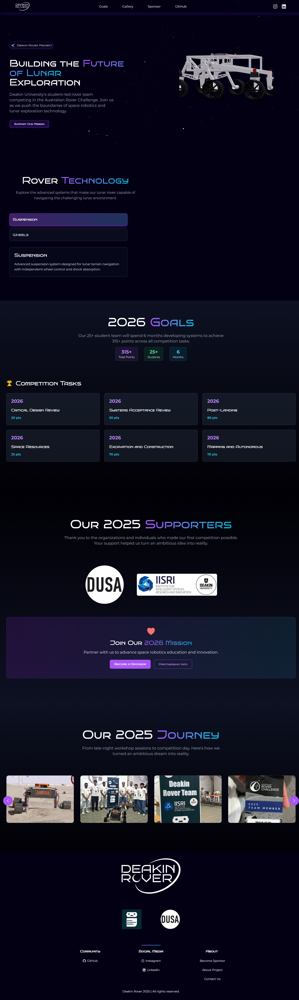

<div align="center">

# Deakin Rover Website

### 🚀 A modern space-themed portfolio website with stunning 3D animations

[](https://opensource.org/licenses/MIT)
[](https://nextjs.org/)
[](https://www.typescriptlang.org/)
[](https://threejs.org/)

[Live Demo](https://deakinrover.space) • [Report Bug](../../issues) • [Request Feature](../../issues)

</div>

---

## 📋 Table of Contents

- [About](#-about)
- [Features](#-features)
- [Tech Stack](#-tech-stack)
- [Screenshots](#-screenshots)
- [Getting Started](#-getting-started)
  - [Prerequisites](#prerequisites)
  - [Installation](#installation)
  - [Running Locally](#running-locally)
  - [Building for Production](#building-for-production)
- [Project Structure](#-project-structure)
- [Contributing](#-contributing)
- [License](#-license)
- [Acknowledgements](#-acknowledgements)

---

## 🎯 About

This website is built on top of the [space-portfolio](https://github.com/sanidhyy/space-portfolio) template created by [Sanidhya Kumar Verma](https://github.com/sanidhyy).

The Deakin Rover website is an immersive, space-themed portfolio built with cutting-edge web technologies. Featuring dynamic 3D graphics, smooth animations, and an intuitive user interface, this website showcases projects, skills, and team information in an engaging and memorable way.

---

## ✨ Features

- 🌌 **Interactive 3D Space Environment** - Stunning starfield and 3D elements using Three.js
- 🎨 **Modern UI/UX** - Clean, responsive design with glassmorphism effects
- ⚡ **Blazing Fast** - Built on Next.js 14 with App Router for optimal performance
- 🎭 **Smooth Animations** - Powered by Framer Motion for fluid transitions
- 📱 **Fully Responsive** - Optimized for all devices and screen sizes
- 🎯 **Skills Showcase** - Categorized display of technical skills with icons
- 💼 **Project Portfolio** - Beautiful project cards with links and descriptions
- 🔗 **Social Integration** - Easy access to social media and contact information
- ♿ **Accessible** - Built with accessibility best practices
- 🌙 **Space Theme** - Immersive cosmic design with purple accent colors

---

## 🛠️ Tech Stack

### Core Framework
- **[Next.js 14](https://nextjs.org/)** - React framework with App Router
- **[TypeScript](https://www.typescriptlang.org/)** - Type safety and better DX
- **[React 18](https://react.dev/)** - UI library

### 3D Graphics & Animation
- **[Three.js](https://threejs.org/)** - 3D graphics library
- **[React Three Fiber](https://docs.pmnd.rs/react-three-fiber/)** - React renderer for Three.js
- **[React Three Drei](https://github.com/pmndrs/drei)** - Useful helpers for React Three Fiber
- **[Framer Motion](https://www.framer.com/motion/)** - Animation library

### Styling
- **[Tailwind CSS](https://tailwindcss.com/)** - Utility-first CSS framework
- **[clsx](https://github.com/lukeed/clsx)** - Conditional className utility
- **[tailwind-merge](https://github.com/dcastil/tailwind-merge)** - Merge Tailwind classes

### Other Libraries
- **[React Icons](https://react-icons.github.io/react-icons/)** - Icon library
- **[Heroicons](https://heroicons.com/)** - Beautiful hand-crafted SVG icons
- **[React Intersection Observer](https://github.com/thebuilder/react-intersection-observer)** - Scroll-based animations
- **[Swiper](https://swiperjs.com/)** - Modern touch slider

---

## 📸 Screenshots

### Home Page


---

## 🚀 Getting Started

### Prerequisites

Before you begin, ensure you have the following installed:

- **Node.js** (v18.0 or higher)
- **npm** or **yarn** package manager
- **Git** for version control

### Installation

1. **Clone the repository**

```bash
git clone https://github.com/mirmisbahali/deakinrover.space.git
cd deakinrover.space
```

2. **Install dependencies**

> **Note:** This project requires the `--legacy-peer-deps` flag due to peer dependency conflicts.

```bash
npm install --legacy-peer-deps
```

Or if you're using yarn:

```bash
yarn install --legacy-peer-deps
```

### Running Locally

Start the development server:

```bash
npm run dev
```

Or with yarn:

```bash
yarn dev
```

Open [http://localhost:3000](http://localhost:3000) in your browser to see the result.

### Building for Production

Create an optimized production build:

```bash
npm run build
npm start
```

Or with yarn:

```bash
yarn build
yarn start
```

---

## 📁 Project Structure

```bash
deakinrover.space/
├── app/                      # Next.js 14 App Router
│   ├── favicon.ico
│   ├── globals.css
│   ├── layout.tsx
│   ├── page.tsx
│   └── sponsor/              # Sponsor page
├── components/
│   ├── main/                 # Main page sections
│   │   ├── encryption.tsx
│   │   ├── footer.tsx
│   │   ├── hero.tsx
│   │   ├── navbar.tsx
│   │   ├── projects.tsx
│   │   ├── skills.tsx
│   │   └── star-background.tsx
│   ├── sponsor/              # Sponsor-related components
│   └── sub/                  # Reusable sub-components
│       ├── hero-content.tsx
│       ├── project-card.tsx
│       ├── skill-data-provider.tsx
│       └── skill-text.tsx
├── config/
│   └── index.ts              # Site metadata configuration
├── constants/
│   └── index.ts              # Static data (skills, projects, links)
├── lib/
│   ├── motion.ts             # Framer Motion configurations
│   └── utils.ts              # Utility functions
├── public/                   # Static assets
│   ├── gallery/              # Gallery images
│   ├── projects/             # Project images
│   ├── skills/               # Skill icons
│   ├── videos/               # Video assets
│   ├── hero-bg.svg
│   ├── lock-main.png
│   ├── lock-top.png
│   └── deakin_rover_logo_white.svg
├── .eslintrc.json
├── .gitignore
├── CLAUDE.md                 # Claude Code instructions
├── LICENSE
├── next.config.js
├── package.json
├── postcss.config.js
├── tailwind.config.ts
├── tsconfig.json
└── README.md
```

---

## 🤝 Contributing

Contributions are what make the open source community such an amazing place to learn, inspire, and create. Any contributions you make are **greatly appreciated**.

### How to Contribute

1. **Fork the Project**
2. **Create your Feature Branch**
   ```bash
   git checkout -b feature/AmazingFeature
   ```
3. **Commit your Changes**
   ```bash
   git commit -m 'Add some AmazingFeature'
   ```
4. **Push to the Branch**
   ```bash
   git push origin feature/AmazingFeature
   ```
5. **Open a Pull Request**

### Contribution Guidelines

- Follow the existing code style and conventions
- Write meaningful commit messages
- Test your changes thoroughly before submitting
- Update documentation as needed
- Be respectful and constructive in discussions

---

## 📄 License

This project is licensed under the **MIT License** - see the [LICENSE](LICENSE) file for details.

This means you are free to use, modify, and distribute this software, provided you include the original copyright notice and license terms.

---

## 🙏 Acknowledgements

- **Original Template:** [space-portfolio](https://github.com/sanidhyy/space-portfolio) by [Sanidhya Kumar Verma](https://github.com/sanidhyy)
- **3D Graphics:** [Three.js](https://threejs.org/) and [React Three Fiber](https://docs.pmnd.rs/react-three-fiber/)
- **Framework:** [Next.js](https://nextjs.org/) by Vercel
- **Animations:** [Framer Motion](https://www.framer.com/motion/)
- **Icons:** [React Icons](https://react-icons.github.io/react-icons/) and [Heroicons](https://heroicons.com/)
- **Styling:** [Tailwind CSS](https://tailwindcss.com/)

---

<div align="center">

Made with 💜 by the Deakin Rover Team

⭐ Star this repository if you find it helpful!

</div>
